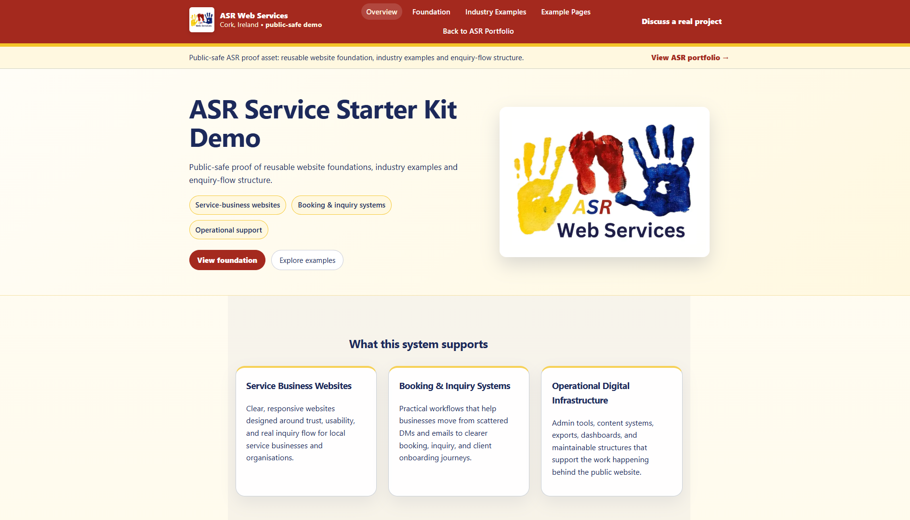
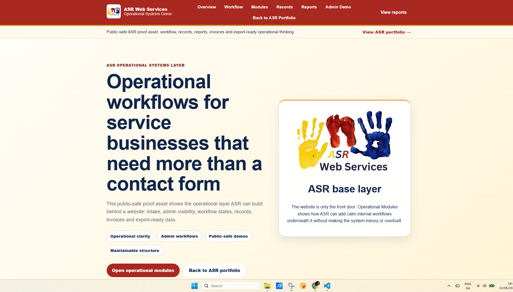

ASR Web Services

Full-stack systems developer building practical websites, booking systems, operational workflows and maintainable digital infrastructure for service businesses.

What I Build

- Business websites
- Booking systems
- Operational workflows
- Admin dashboards
- Process automation
- Client portals
- Reporting and export systems

My work focuses on helping organisations reduce administrative friction, improve visibility and create better customer journeys.

Portfolio

https://asrweb.ie/portfolio

Case Studies

https://asrweb.ie/case-studies

ForwardSteps

A custom booking and administration platform developed for a psychology practice, including patient management, booking workflows, invoicing and reporting.

Aid Cancer Treatment (ACT)

A long-term charity partnership involving website redevelopment, fundraising support, event promotion and ongoing stewardship.

Live Demonstrations

Starter Kit

https://asr-web-services-starter-kit.onrender.com/

Reusable service-business website foundation demonstrating responsive layouts, enquiry flows, content structure and maintainable architecture.

## Screenshots

### Homepage

Operational Systems Demo

https://asr-operational-systems-demo.onrender.com/

Public-safe operational workflow demonstration showing booking workflows, administration concepts, reporting visibility and operational infrastructure.

### Home Desktop

Technology

- Node.js
- Express
- EJS
- JavaScript
- HTML
- CSS
- MongoDB concepts and operational data modelling

Contact

Website: https://asrweb.ie

Email: admin@asrweb.ie

LinkedIn:
https://www.linkedin.com/in/karl-murphy-514933249

Philosophy

Simple done properly beats fancy done badly.

The goal is not simply to launch websites. The goal is to build systems that remain useful, maintainable and understandable long after launch.
